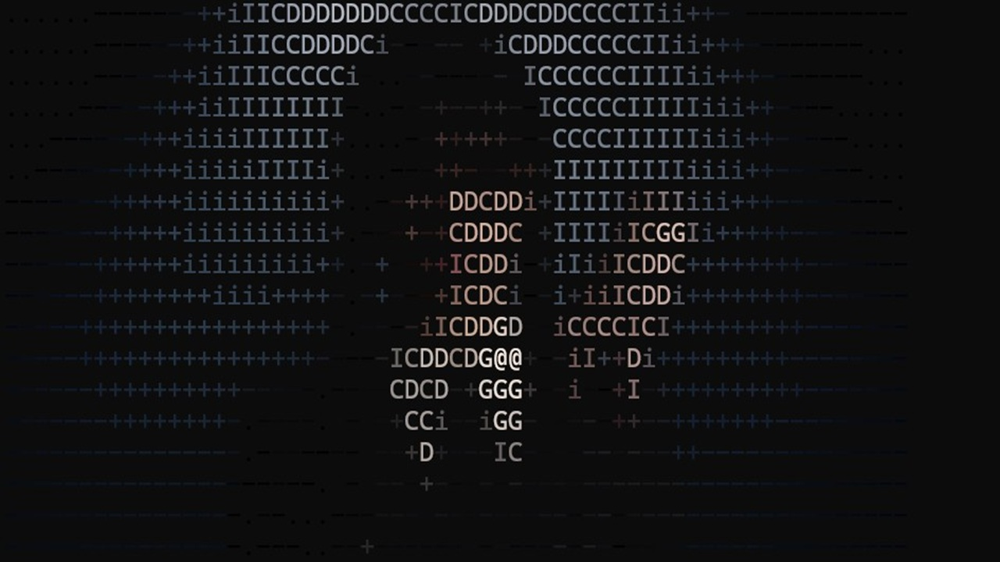

# ascii-image-converter

A simple CLI tool to convert images to ASCII art.

## Features

- Convert an image to ASCII art (color and monochrome).
- Save an intermediate chunked image (`output.jpg`).
- Simple CLI with configurable width and character aspect ratio.

## Examples

| Original |Width 60 | Width 120 | Width 250 |
| --- | --- | --- | --- | 
|  |  |  | 

## Requirements

- Go (see [go.mod](go.mod) for target version)

## Install

Build the binary:

```sh
go build ./cmd
```

## Usage
Provide a path to an image file as the last argument. Example:
```
# run with defaults
go run ./cmd path/to/image.jpg

# custom width, ratio and color
go run ./cmd -w 80 -r 0.6 -c false path/to/image.jpg
```

## CLI flags


## License
This project is licensed under the MIT License — see [LICENSE](LICENSE).


